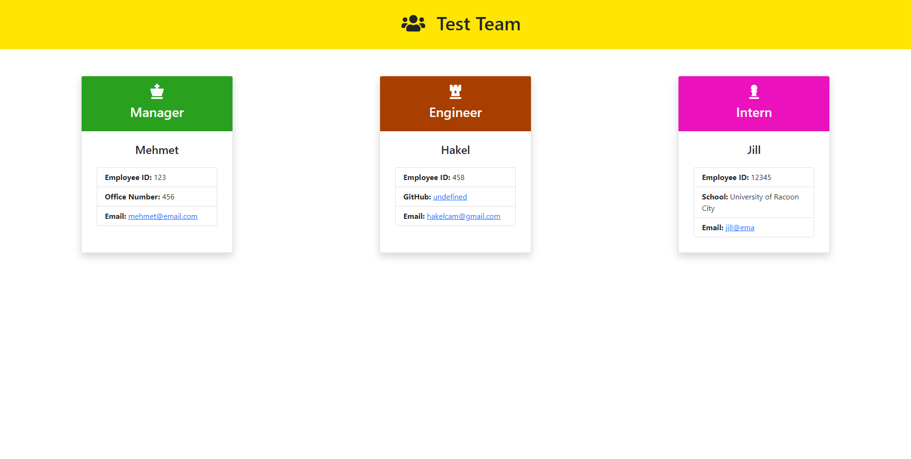

# Team Profile Generator


## Description

    This application was created to generate a team profile based on user input using the Inquirer module from Node.js and displaying the information on a newly created html page with a style sheet. This project also using Jest.

## Table of Contents

- [Team Profile Generator](#team-profile-generator)
  - [Description](#description)
  - [Table of Contents](#table-of-contents)
  - [Usage](#usage)
  - [Installation](#installation)
  - [Lunch the App](#lunch-the-app)
  - [License](#license)
  - [Link to the Video Recording](#link-to-the-video-recording)
  - [Sample Team HTML](#sample-team-html)
  - [Screenshot](#screenshot)
  - [Contributors](#contributors)
  - [Tests with Coverage](#tests-with-coverage)
  - [Tests with Watch Mode](#tests-with-watch-mode)
  - [Questions](#questions)

## Usage

    Use inquirer from your command line to answer questions about your project

## Installation

The user should clone the repository from GitHub and download Node. This application also requires a file system and inquirer module. If testing is required, this application uses Jest.

```
git clone https://github.com/Hakkelo89/Team_Profile_Generator

cd Team-Profile-Generator

npm i
```

## Lunch the App

`npm run start`

## License

    [](https://opensource.org/licenses/MIT)

## Link to the Video Recording

Please click [here](https://drive.google.com/file/d/1W3ecGNMnWNTUTq99wvG_OVguJLH746CO/view) to view the demo.

## Sample Team HTML

Please click [here](https://github.com/Hakkelo89/Team_Profile_Generator/blob/main/output/team.html)

## Screenshot



## Contributors

Contributors should read the installation section.

## Tests with Coverage

`npm run test`

## Tests with Watch Mode

`npm run test:watch`

## Questions

If you have any questions regarding this app, please contact me via:

- Email at hakelcam@gmail.com
- GitHub at <https://github.com/Hakkelo89>
